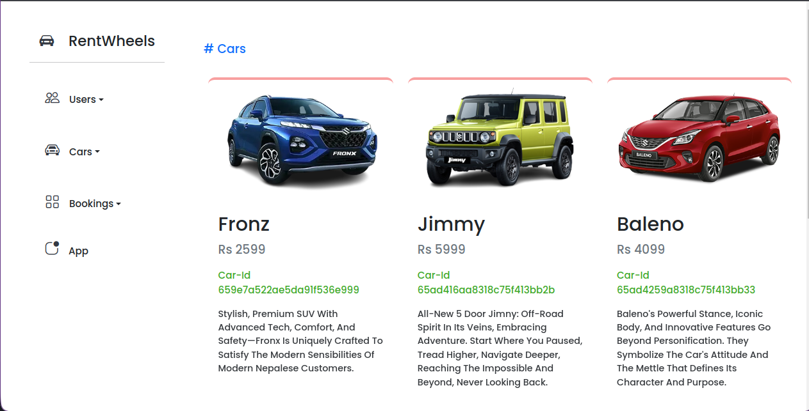

# CAR RENTAL SYSTEM

Simple car rental system

admin client server


## Requirements
[node](https://nodejs.org/)


## Installation(run locally)

use git clone to clone the project
```bash
git clone https://github.com/Peris-rana/car-rental-system.git
```

run the client admin and the server

client

```bash
  npm install
  npm run dev
```
admin

```bash
  npm install
  npm run dev
```
server


```bash
  npm install
  npm start
```
    
    
## Environment Variables

To run this project, you will need to add the following environment variables to your .env file

.env file should be created in client, admin and server

#### admin
VITE_APP_API=http://localhost:5900

### client
VITE_APP_API=http://localhost:5900

### server
MONGO_URL=mongodb://localhost:27017car-rental-system'

JWT_SECRET=qazwsx

create a database name car-rental-system in you system locally

## Screenshots

### admin
homepage


viewcars


viewusers


